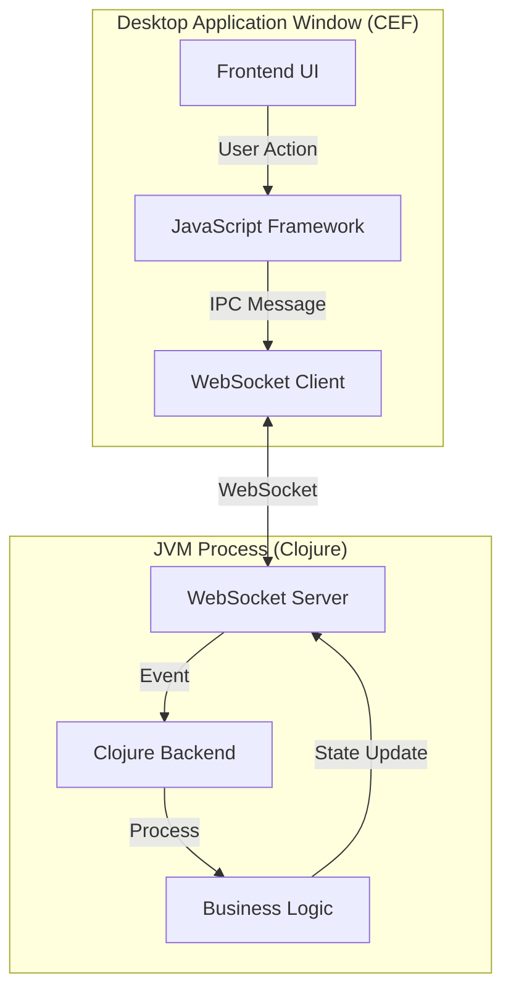

# Zenthyr

> **A Modern Clojure Framework for Desktop Applications**
> *Combine the power of Clojure backend logic with the flexibility of modern web frontends.*

---

## 📖 Introduction

**Zenthyr** is a robust framework designed to bridge the gap between Clojure's powerful data processing capabilities and the rich ecosystem of modern web technologies. It allows you to build cross-platform desktop applications using **Clojure** for the backend logic and your favorite JavaScript framework (**React**, **Vue**, **Svelte**, or **Angular**) for the frontend, all packaged within a native desktop shell.

### Key Features

*   **🚀 Clojure Backend**: Leverage the full power of Clojure (JVM) for your application logic, data processing, and system interactions.
*   **🎨 Modern Frontend Stack**: Build your UI with **React**, **Vue**, **Svelte**, or **Angular**, powered by **Vite** for lightning-fast HMR (Hot Module Replacement).
*   **⚡ Seamless IPC**: Bidirectional communication between your Clojure backend and JavaScript frontend via WebSocket, making data flow effortless.
*   **🖥️ Native Integration**: Wraps your application in a Chromium Embedded Framework (CEF) window for a native desktop experience.
*   **🛠️ Developer Experience**: Built-in Leiningen template for instant project scaffolding with git initialization and best practices.

---

## 🏗️ Architecture

Zenthyr operates on a dual-process architecture to ensure separation of concerns and performance:



1.  **Backend (JVM):** Runs the Clojure runtime, handles business logic, file I/O, and system operations.
2.  **Frontend (Chromium):** Renders the UI using standard web technologies.
3.  **Communication:** Messages are passed between the two layers seamlessly.

---

## 🚀 Getting Started

### Prerequisites

Ensure you have the following installed on your system:

*   **Java JDK 8+** (Required for Clojure)
*   **Node.js & npm** (Required for frontend dependencies)
*   **Leiningen** (Clojure build tool)

### Creating a New Project

Zenthyr comes with a powerful Leiningen template to bootstrap your application in seconds.

**1. Install the Template (if developing locally)**
If you are using a local version of Zenthyr, install the template first:
```bash
# From the zenthyr/template directory
lein install
```

**2. Generate a Project**
Run the following command to create a new application. You can specify your preferred frontend framework:

*   **React** (Default):
    ```bash
    lein new zenthyr my-app
    ```
    *Or explicitly:* `lein new zenthyr my-app +react`

*   **Vue**:
    ```bash
    lein new zenthyr my-vue-app +vue
    ```

*   **Svelte**:
    ```bash
    lein new zenthyr my-svelte-app +svelte
    ```

*   **Angular**:
    ```bash
    lein new zenthyr my-angular-app +angular
    ```

**3. Run the Application**
Navigate to your new project folder and start it up:
```bash
cd my-app
lein run
```

This will automatically:
1.  Initialize a git repository.
2.  Install frontend dependencies (`npm install`).
3.  Start the Vite development server.
4.  Launch the Clojure backend and open the application window.

---

## 🛠️ Development Guide

This section is for contributors and developers working on the **Zenthyr framework itself**.

### Directory Structure

*   `src/zenthyr/`: Core framework source code (Clojure).
*   `template/`: The Leiningen template source code.
*   `project.clj`: Configuration for the core library.

### Workflow

#### 1. Developing the Core Library
When you modify the core library (`src/zenthyr/`), you must install it to your local Maven repository so other projects can use the updated version.

```bash
# In the root of the zenthyr repo
lein install
```
*Installs to `~/.m2/repository/zenthyr/zenthyr/0.1.0-SNAPSHOT/`.*

#### 2. Developing the Template
If you change the template structure or generation logic (in `template/`), install it locally:

```bash
# In the template/ directory
cd template
lein install
```

#### 3. Testing Changes
*   **Library Changes:** Restart your test application. If it depends on `[zenthyr "0.1.0-SNAPSHOT"]`, it will pick up the latest local build.
*   **Template Changes:** Generate a new dummy project to verify scaffolding:
    ```bash
    lein new zenthyr temp-test-app
    ```

### Updating Existing Projects

If you have an existing application and want to upgrade to a newer version of Zenthyr:

1.  **Update `project.clj`**:
    Change the dependency version in your application's `project.clj`:
    ```clojure
    :dependencies [[org.clojure/clojure "1.11.1"]
                   [zenthyr "0.2.0"]] ;; Update version here
    ```

2.  **Force Dependency Refresh** (for SNAPSHOTs):
    If `lein` doesn't pick up the changes, force an update:
    ```bash
    lein deps :force
    ```

---

## 📦 Publishing

To release Zenthyr to the world (Clojars), follow these steps:

### Prerequisites
1.  Create an account on [Clojars](https://clojars.org/).
2.  Generate a **Deploy Token**.
3.  Authenticate locally:
    ```bash
    lein deploy clojars
    # Username: Your Clojars username
    # Password: Your Deploy Token
    ```

### Release Process

**1. Publish the Library**
Update the version in `project.clj` (remove `-SNAPSHOT` for stable releases).
```bash
# In project root
lein deploy clojars
```

**2. Publish the Template**
Update the version in `template/project.clj`.
```bash
# In template/ directory
cd template
lein deploy clojars
```

---

## 🤝 Contributing

We welcome contributions! Please follow these steps to contribute:

1.  **Fork** the repository.
2.  **Clone** your fork locally.
3.  Create a **new branch** for your feature or bugfix (`git checkout -b feature/amazing-feature`).
4.  Commit your changes (`git commit -m 'Add some amazing feature'`).
5.  Push to the branch (`git push origin feature/amazing-feature`).
6.  Open a **Pull Request**.

Please ensure your code follows the project's coding standards and includes appropriate tests.

---

## 📄 License

Copyright © 2025

This program and the accompanying materials are made available under the terms of the **Eclipse Public License 2.0** which is available at [http://www.eclipse.org/legal/epl-2.0](http://www.eclipse.org/legal/epl-2.0).
