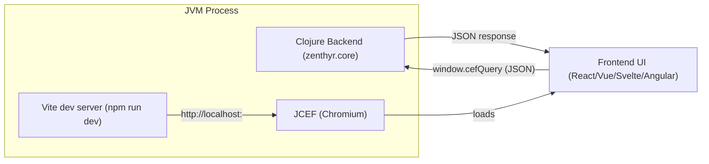

# Zenthyr

Zenthyr is a Clojure library (plus a Leiningen template) for building desktop applications with a JVM backend and a modern web UI rendered inside a JCEF (Chromium) window.

It focuses on a tight dev loop: generate a project, run `lein run`, and iterate with Vite hot reload while your Clojure backend stays in control.

## Status

- Alpha: API and project structure may change.
- macOS-first: dock/window lifecycle is implemented and validated on macOS.
- IPC: uses JCEF’s `cefQuery` (CefMessageRouter), not WebSockets.
- Frontend choices: React (default), Vue, Svelte, Angular (all Vite-based templates).

## Table of contents

- Getting started
- Architecture
- IPC (frontend ↔ backend)
- Window/process lifecycle (macOS)
- Developing Zenthyr (library + template)
- Updating an existing app
- Publishing (Clojars)
- Contributing
- License

## Getting started

### Prerequisites

- Java (JDK installed and on PATH)
- Node.js + npm
- Leiningen

### Create a new app

If you are developing Zenthyr locally, install the template first:

```bash
cd template
lein install
```

Generate a project (this also runs `git init` inside the generated folder):

```bash
lein new zenthyr my-app
```

Select a frontend framework:

```bash
lein new zenthyr my-react-app   +react
lein new zenthyr my-vue-app     +vue
lein new zenthyr my-svelte-app  +svelte
lein new zenthyr my-angular-app +angular
```

Run it:

```bash
cd my-app
lein run
```

What happens when you run:

- Ensures frontend dependencies (`npm install`) exist (creates `node_modules/` if needed).
- Starts Vite (`npm run dev`) on an available port.
- Opens a JCEF window pointing at the Vite dev server.

### Generated app layout (important files)

- `project.clj` (depends on `zenthyr`)
- `src/<app-namespace>/main.clj` (your entrypoint, with `-main`)
- `src/app/` (Vite project root, UI sources under `src/app/src/`)

## Architecture

Zenthyr runs your backend and UI in the same JVM process, with the UI rendered by JCEF (Chromium). The UI is served during development by Vite, and the backend communicates with the UI via JCEF’s message router (`cefQuery`).



## IPC (frontend ↔ backend)

Zenthyr injects a small bridge into the page, exposing:

- `window.zenthyr.invoke(message)` → returns a Promise resolving to a JSON response
- `window.zenthyr.emit(message)` → fire-and-forget style message

On the backend, you provide a `:handler` function to `zenthyr/start-app!` which receives the parsed JSON message and returns a Clojure map that will be encoded back to JSON.

## Window/process lifecycle (macOS)

Zenthyr aims to behave like a native macOS app:

- Window close button: hides the window, keeps the process alive (dock icon stays).
- Dock icon click: reopens the window.
- Quit (Cmd+Q or Dock menu Quit): exits the JVM and shuts down child processes (including Vite).

This behavior is implemented using `java.awt.Desktop` app event handlers plus Swing window hooks.

## Developing Zenthyr (library + template)

### Library development

From the repo root:

```bash
lein test
lein install
```

`lein install` installs the library jar into your local Maven repo so apps depending on `[zenthyr "0.1.0-SNAPSHOT"]` can use it immediately.

### Template development

```bash
cd template
lein install
```

Then generate a fresh app to validate changes:

```bash
lein new zenthyr template-smoke-test +react
```

## Updating an existing app

Update the `zenthyr` dependency in your app’s `project.clj`:

```clojure
:dependencies [[org.clojure/clojure "1.11.1"]
               [zenthyr "0.1.0-SNAPSHOT"]]
```

If you are using a SNAPSHOT and Leiningen appears to keep using cached artifacts:

```bash
lein deps :force
```

## Publishing (Clojars)

Zenthyr is meant to be published as:

- the library artifact (`zenthyr`)
- the template artifact (`zenthyr/lein-template`)

Typical flow:

- Create a Clojars account and deploy token.
- Bump versions in [project.clj](file:///Users/sergio/Projects/zenthyr/project.clj) and [template/project.clj](file:///Users/sergio/Projects/zenthyr/template/project.clj).
- Deploy:

```bash
lein deploy clojars
cd template
lein deploy clojars
```

## Contributing

- Create a feature branch.
- Keep changes focused and testable.
- Run tests before opening a PR:

```bash
lein test
```

- Prefer updating existing code and keeping public APIs small and explicit.

## License

Copyright © 2025

This program and the accompanying materials are made available under the terms of the Eclipse Public License 2.0 which is available at http://www.eclipse.org/legal/epl-2.0.
